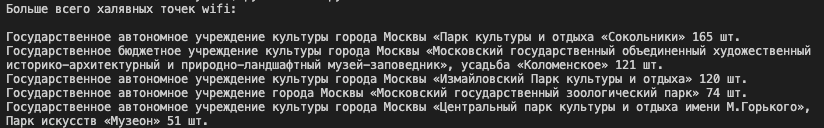
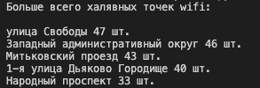

# WiFiSearch

WiFiSearch - это скрипт, который позволит найти на каких улицах Москвы больше всего халявных wi-fi точек.
Для работы скрипта потребуются данные о wi-fi точках с сайта [открытых данных Москвы](https://data.mos.ru/opendata?categoryId=121).

## Начало работы

Скачайте данные о wi-fi точках в Московских библиотеках, кинотеатрах, культурных центрах и парках с сайта [открытых данных](https://data.mos.ru/opendata?categoryId=121) в формате `.json`. Полученные файлы сохраните в папку `wifi_data`.

## Как это работает

Зпаустите скрипт командой `python3 main.py`.
В консоли появится результат:

## GEOCODE

В данных о wi-fi точках в Московских парках нет указания адреса/улицы, только наименование парка. При этом для всех точек есть данные об их координатах.

В файле `geocode.py` реализовоно определение улиц местоположения wi-fi точек с использованием Yandex geocoder API.

### Запуск скрипта goecode

Установите библеотеки, необходимые для работы, перечисленные в `requirements.txt`.

Для работы с Yandex geocoder API, получите API ключ в [кабинете разработчика](https://developer.tech.yandex.ru/services/) и сохраните его в файле `settings.py` в формате:

    API_KEY = "bcc59a3b-d7d5-36аe-84сb-5а178e2edbe6"

Зпаустите скрипт командой `python3 goecode.py`.
Придётся подождать )
В консоли появится результат:

